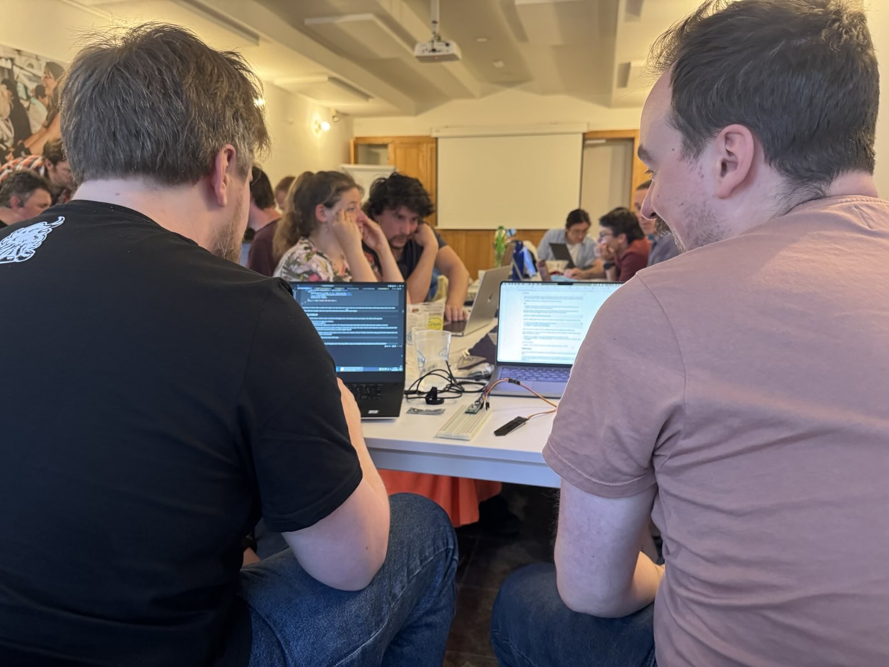
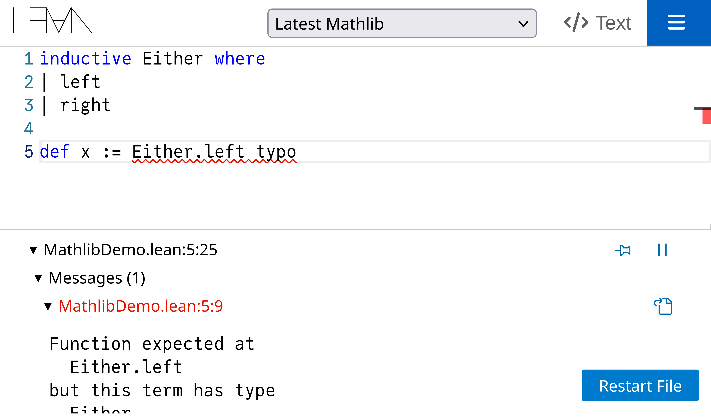
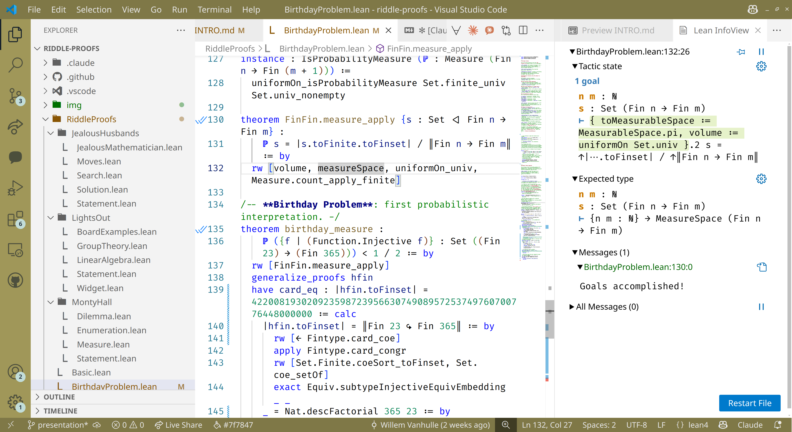
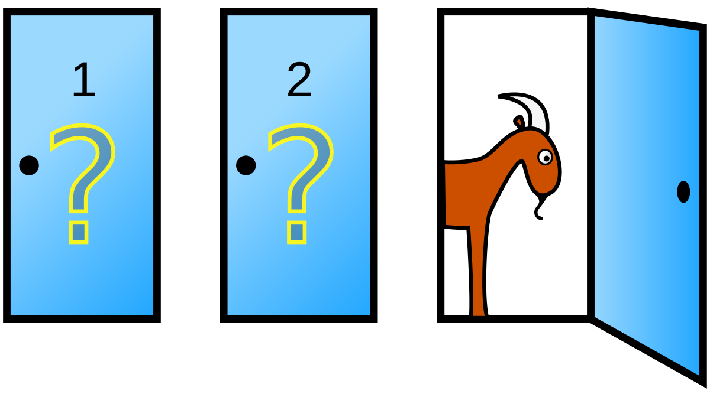

# Sysghent

Community for systems programmers.


Today: **Learn lean with riddles**.

- Brush up on your mathematics.
- Brush up on your functional programming skills.
- Express your wildest ideas in a programming language.


> Overall, Lean is **just fun**!


---


# Past events


| Date           | Title                                   | Description                                                                 |
|----------------|-----------------------------------------|-----------------------------------------------------------------------------|
| 2025-06-23     | Connect and Unwind                      | Come relax, share ideas, and enjoy some drinks in a friendly atmosphere.    |
| 2025-06-04     | Grow smarter with embedded Rust         | Create your own smart plant pot with a Pico microcontroller, Rust and Embassy. |
| 2025-04-01     | Functional Programming                  | Explore the principles and applications of functional programming in modern software development. |
| 2025-01-21     | Tech talks                              | Introduce your favorite systems programming side-project to colleagues.      |
| 2024-12-18     | Launch event                            | Meet and greet systems programmers in a cozy bar near the city center.      |

---

# Photos plant pot workshop

Built your own smart plant pot with Rust and a Pico.

- Workshop last month on 4th of June 2025
- First workshop with Raspberry Pico and Rust
- Popular, 30 participants, even couples on date



---

# Lean


Lean is flexible:

- Advanced **programming language**
  - Monads: containers for stuff that needs context
  - Dependent types: e.g. vectors of list N
  - In-place modification compiler optimizations
- Mathematical **theorem prover**
  - Largest database of mathematical theorems: Mathlib
  - Both constructive and classical logic
  - Tactic / meta-programming
  - Supports **concurrent separation logic**: prove correctness of concurrent imperative programs.

---

# Lean and systems programming


Lean can be used  **verification**:

- Check functioning custom processors.
- Detecting bugs in the Rust standard library.
- Detecting bugs in other systems languages.

Solving internation mathematical olympiad problems is also possible. 

See AlphaProof by Google: https://deepmind.google/discover/blog/ai-solves-imo-problems-at-silver-medal-level/

---

# No installation needed

Online IDE: https://live.lean-lang.org/




---

# Local installation

Local IDE: VS Code with extension `leanprover.lean4`

```bash
git clone git@github.com:wvhulle/learn-lean-riddles.git
cd learn-lean-riddles
code .
```




---


# Plan for today

Learn Lean using computational problems / riddles.

Monty Hall problem:



Jealous husbands problem:


And more!

... First, a basic introduction to Lean.

---

# Learning resources Lean

Where should you start?

- Official list: https://leanprover-community.github.io/learn.html
- My notes for this workshop: https://github.com/wvhulle/learn-lean-riddles
  - contains instructions for installation
  - computation problems (riddles), partially or fully solved
  - tips for creating Lean modules

How to choose?

- You are a **mathematician**? Start with "Mathematics in Lean"
- You are a **developer**? Start with "Functional programming Lean"
- You are a **language nerd**? Read "Tactic programming guide"
- You are **something else**? Try the interactive "Natural number game"

---

# Most important insight


Every book about theorem provers starts with:

> **Mathematics = Programming**


What does this mean?

- Proving things in mathematics is like writing programs.
- Writing programs is like proving things in mathematics.

How exactly?

- **Propositions are types**.
- **Proofs are programs**.

See work by:

- Mathematical: Brouwer, Heyting, Kolmogorov, 
- Computational: Curry, Howard.

---

# Object-oriented data-types

Similar to records or objects.

```lean
structure RGB where
  red : Nat
  green : Nat
  blue : Nat
```

Inheritance / extension is possible with `extends`.

A constructor is written separately:

```lean
def pureGreen : RGB :=
  { red := 0x00
    green := 0xff
    blue := 0x00 }
```

Sometimes, inline, you would write:

```lean
{ red := 0x00, green := 0xff, blue := 0x00 : RGB}
```

---


# Recursive data-types

The prototype of a data-type is the natural numbers:

```lean
inductive Nat : Type where
| zero : Nat
| succ : Nat → Nat
```

Inductive data-types are a generalization of the natural numbers:

```lean
inductive List (α : Type) : Type where
| nil : List α
| cons : α → List α → List α
```

Notice, this is a generic type.


---

# Functions

A simple function:

```lean
def shuffle (c : RGB) : RGB :=
  { red := RGB.green c
    green := RGB.blue c
    blue := RGB.red c }
```

Evaluation is not the core purpose of Lean, but it is easy and explicit:

```lean
#eval append N [3, 1] [4, 1, 5]
#eval append _ [3, 1] [4, 1, 5]
```
---


# Termination

By default, functions that start **without `partial` have to be terminating**.

```lean
def append (α : Type) : List α → List α → List α
| List.nil, ys => ys
| List.cons x xs, ys => List.cons x (append α xs ys)
```

Termination checks can be:

- automatically inferred by the compiler
- proven by manually specifying a measure in the definition
- proven by manually proving well-foundedness of recursion

Usually, when you do brute-force search, you do not care about termination (because you know that the computation is unbounded):

```lean
partial def bruteForceSearch (xs : List Nat) : List Nat :=
  match xs with
  | List.nil => List.nil
  | List.cons x xs' => sorry
```

---

# Definitions vs theorems


Definitions and theorems have identical syntax:

A definition (program):

```lean
def add_comm_zero_left (n : Nat) :
  add 0 n = add n 0 :=
  add_comm 0 n
```


As a theorem (proof):

```lean
theorem add_comm_zero_left (n : Nat) :
  add 0 n = add n 0 :=
  add_comm 0 n
```

---

# Functional proofs vs tactic proofs

You can prove theorems in Lean using functional style:

```lean
theorem double_add (n : Nat) : n + n = 2 * n :=
  (Nat.two_mul n).symm
```

You can also prove theorems in Lean using tactics (like `intro`, `exact`):

```lean
theorem double_add' (n : Nat) : n + n = 2 * n := by
  exact (Nat.two_mul n).symm
```

---

# Relational proofs

You can use relational reasoning with the `rw` (rewrite), `simp` (simplify) tactics:

```lean
theorem add_assoc_example (a b c : Nat) : 
  (a + b) + c = a + (b + c) := by
  rw [Nat.add_assoc]
```

The `rw` tactic replaces the left-hand side of the equation from the lemma `Nat.add_assoc` with the right-hand side when the left-hand-side matches.

Relational `calc` style proofs reflect the traditional style of writing proofs:

```lean
theorem calc_example (a b : Nat) : 
  (a + b) * (a + b) = a * a + 2 * a * b + b * b := by
  calc (a + b) * (a + b) 
    = a * (a + b) + b * (a + b) := by rw [Nat.add_mul]
    _ = a * a + a * b + b * (a + b) := by sorry
    _ = a * a + 2 * a * b + b * b := by ring
```

You can also use other relations like `<->` or `<`. 

---

# Backward proofs

Uses tactics like `apply`:

```lean
theorem modus_ponens (p q : Prop) : p → (p → q) → q := by
  intro hp
  intro hpq
  apply hpq
  exact hp
``` 

The `apply hpq` tactic tries to replace a proof goal of `q` with `p`, knowing that `p` implies `q` (i.e. `hpq` is a proof of `p → q`).

Harder to read. Reversed: **start with goal and work backwards.**

More common in formal mathematics, less common in functional programming.


---

# Namespaces

Namespaces are a way to organize code in Lean. They kind of tag statements to belong in a certain sub-category. 

Statements under the same **namespace in different imported files are merged together**.

```lean
namespace MyNamespace
def myFunction (x : Nat) : Nat :=
  x + 1
end MyNamespace
```

Without opening a namespace, you to use a fully-qualified name to refer to definitions:

```lean
#eval MyNamespace.myFunction 5
-- Or you can use the `open` keyword to bring all definitions from a namespace into scope:
open MyNamespace
#eval myFunction 5
```

---

# File imports

Lean files are namespaces with file path.

For example, the file `RiddleProofs/BlueEyedIslanders.lean` defines the namespace `RiddleProofs.BlueEyedIslanders`.


You can import a file using the `import` keyword:

```lean
import RiddleProofs.BlueEyedIslanders
```

The **namespace associated with a file import is automatically opened**. 

---

# Visibility


When you want to fine-tune visibility: definitions that are nested in an inner namespace (which may have the same name) have to be opened explicitly.


Use the `local` keyword to hide definitions from being visible outside their namespace / file:

```lean
namespace MyNamespace
local def myLocalFunction (x : Nat) : Nat :=
  x + 1
end MyNamespace
```


---

# What's next?

Mathlib4 is the most popular Lean library.

- Contains all of undergraduate mathematics.
- Contains all of graduate mathematics.
- Contains most of research-level mathematics.
- But, **no riddles**!

What about the riddles?

- Mathlib4's section on conditional probability:
  https://leanprover-community.github.io/mathlib4_docs/Mathlib/Probability/ConditionalProbability.html
  Few to no examples.
- 100 examples of famous problems / proofs
  https://leanprover-community.github.io/100.html
  One is the **birthday paradox** and uses a uniform discrete density.

---

# Easy learning material

How to choose?

- You are a **mathematician**? 
  - Start with the interactive tutorial "Mathematics in Lean".
  - Look at "100 theorems in Lean".
  - Look at the Mathlib4 index page.
  - Join the "math" channel on [Lean Zulip chat](https://leanprover.zulipchat.com/).
- You are a **developer**? 
  - Start with "Functional programming Lean"
  - Read the [Lean reference manual](https://lean-lang.org/doc/reference/latest/)
- You are a **language nerd**?
  - [Hitchhiker's Guide to Logical Verification (2023 Edition)](https://lean-forward.github.io/hitchhikers-guide/2023/)
  - Read "Tactic programming guide"
  - Read "Metaprogramming in Lean"
- You are **something else** and want something simple? Try the interactive "Natural number game" at [Lean games (University Düsseldorf)](https://adam.math.hhu.de/).

---

# Jealous husbands

First read `Statement.lean`.


- Can you generalize to N couples?
- What about more than 2 people in a boat?
- Can you optimize my BFS in `Search.lean`?
- Like `JealousMathematician.lean`, can you write a version for "cannibals and missionaries"?

---

# Lights out

Look at examples in `BoardExamples.lean` and visualisation in `Widget.Lean`.

Mathematical interpretation is in `LinearAlgebra.lean`.

- Can you write a brute-force function (in Lean) to search solutions?
- Which start configurations are solvable?
- Which start configurations are insolvable?


Frontend:

- Define a way to visualize steps, one at a time, while manually testing the puzzle.
- Make cells in the widget clickable.

Group theory:

- Try to read and understand the lemmas used in `GroupTheory.lean`.
- Try to compute a product of two matrices.

---

# Monty Hall

First look at `Statement.lean`.


- Derive a statement for the "total probability" law
- Proof the total probability law as a theorem / lemma.
- Replace boilerplate proof code in `Dilemma.lean` by the total probability law.

---

# Birthday problem

- What if there were more days in a year?
- Understand what kind of probability distributions are available for Lean in Mathlib4 (or other projects?).
- Model another similar probabilistic problem / paradox, using another distribution.


---

# Learning resources Lean

Where should you start?

- Official list: https://leanprover-community.github.io/learn.html
- My notes for this workshop: https://github.com/wvhulle/learn-lean-riddles
  - contains instructions for installation
  - computation problems (riddles), partially or fully solved
  - tips for creating Lean modules

Want to know more?

- You are a **mathematician**? Start with "Mathematics in Lean"
- You are a **developer**? Start with "Functional programming Lean"
- You are a **language nerd**? Read "Tactic programming guide"
- You are **something else**? Try the interactive "Natural number game"